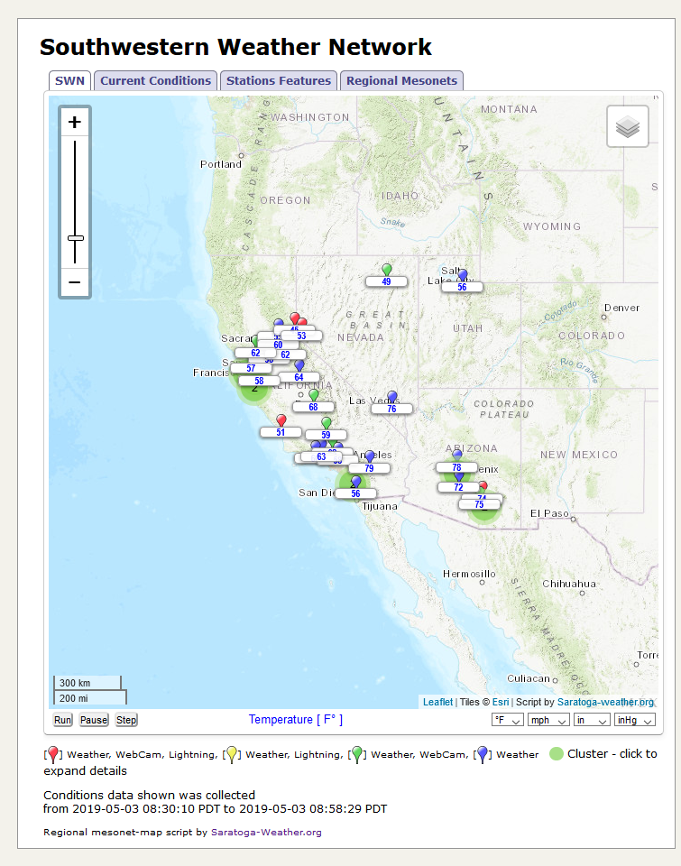

# <a name="regionalmap" id="regionalmap"></a>Regional Mesonet Map Display

The **[Affiliated Regional Weather Networks](http://www.northamericanweather.net/)** have been quite popular, and now it is possible for you to add a Leaflet map display of conditions from your network to your own website. We do _prefer_ that the script(s) be used by members who contribute their data to a Regional Weather Network. Version 4.x of the script no longer uses Google Maps, but uses Leaflet/OpenStreetMaps for display and no longer requires an API key or Access Token for operation with the free maps included. Version 4.x also allows Mapbox maps with a Mapbox API key to be used..

This script set is intended to replace the V2.x [netID]-mesomap.php script for Regional Network members and provides multiple language support for Standalone or Saratoga Template use.

Here's a sample of the display:



My thanks to Wim van der Kuil of [Leuven Templates](http://www.leuven-template.eu/) for the idea to use the tabbed presentation to separate the map/conditions/stations displays.

## Short history of the [netID]-mesomap.php software

The V0.x version of the mesonet map for the Southwestern network used a map graphic and each station in the network published a bit of HTML with conditions that were rotated by a common JavaScript. The system became unmanagable as more stations entered the network, and the conditions rotated on the map in an unsyncronized manner. Not very satisfying.

The V1.x version used a PHP script to run on each member website (when the page was viewed) that did a quick pull of conditions from each member station, then displayed the result on a dynamically created static map with rotating conditions displayed for each station. As the network grew to above 20 stations, this proved unworkable as the fetch-time for conditions from each station was added to the page-load time and times of 40+ seconds were observed on a good day. So.. back to the drawing board.

The V2.x version used the map/data display of the 1.x version, but a new 'Regional Hub' website was created and a cron job run to collect the data from each station and save it in a text file. The member stations would read that text file (fast) and produce the map/data table quickly now that the fetch-time had been 'offloaded' to the server. The member station would only fall-back to collecting data individually from each site if the 'Regional Hub' site was unavailable, or the data more than one hour old.

The V2.x version also added in multi-language support for displays. A separate language translation mechanism was used so the resulting mesonet map could run in any PHP-based website.

Now V3.x version has some fundamental changes from the prior versions:

1.  The map display is based on Google Maps, JavaScript and the Latitude/Longitude of the member station to place the pin on the map. This is a both good and bad news. The good news is that Regional Networks that adopt the V3.x software do not have to fuss about with manually placing a pin on an image to add or remove a station. The bad news is that without JavaScript, no map will be displayed (the V2.x version would display a map and temperature without JavaScript). But.. the web seems bent on doing mostly everything using JavaScript, so here we go.
2.  The code to fetch data directly from member stations has been removed. The V3.x map relies on having the Regional Hub site for availability. It does cache the configuration and data files every 5 minutes and will display what it last received. If the Regional Hub is unavailable for an extended period, the member maps will show stale data until the Regional Hub is working again.
3.  The regional networks definition file is also downloaded routinely, so as networks come/go/change, the mesonet-map will adapt. If an existing network is removed from the Global nets, then an error message will be displayed instead of the map, and a new network can be picked from the cache/mesonet-map-networks.txt file. We've only had 3 networks drop out in 8+ years.
4.  Yes, I know the code is a bit of a mess.. it has been growing 'organically' for 8 years. I did some refactoring with variable names and separation of functions from merging two sets of code: the [netID]-mesomap.php and the global-map.php code based. I figure I've been fiddling with this over two years in low priority, so it's time to get it done and declare V3.0 released. I hope you enjoy!

Version 4.x has even more fundamental changes from prior versions:

1.  The script now uses [Leaflet](https://leafletjs.com/) V1.3.1 JavaScript library and open source map providers instead of a Google for map displays, so **no API key is needed for the basic maps**.
2.  Support is provided for [Mapbox.com](https://mapbox.com/) maps which will be automatically enabled if you specify a Mapbox API key in the mesonet-map-settings.php file (or in Settings.php for Saratoga templates).
3.  The Leaflet code seems to be much faster in rendering the maps and markers than the older Google-based code (bonus!)
4.  A downside of using non-Google maps is that (for the most part) the map legends for countries/cities/names are all shown in English only.  
    The OpenStreetMap does show country names/cities in the native language of the country on the map, but the other maps are English names only. The translation files included do handle the legend/marker/popup language content translation as did the V3.x version of the scripts.
5.  Additional new features added in Version 4.00 include:
    *   Right-click context menu for map that will display the lat/long of the point, the settings needed to configure that map view as a default, center the map, zoom in and zoom out. The settings needed has the three key variables (zoom, center and clusterRadius) used to make that map be the default view.
    *   Stations that are 'Offline' (no current conditions within one hour) no longer show a label / rotating legend.
    *   A configuration option to set the clustering behavior is now available--you can choose to more agressively cluster markers to create a less cluttered map display.

## Package contents:

<dl>

<dt>**_mesonet-map-README.txt_**</dt>

<dd>Text document with background, package information and install/configuration information</dd>

<dt>**_mesonet-map.php_**</dt>

<dd>standalone script to display the mesonet map</dd>

<dt>**_wxmesonetmap.php_**</dt>

<dd>Saratoga template page to display the mesonet map</dd>

<dt>**_mesonet-map-settings.php_**</dt>

<dd>control file for the default map displays - this is the file you customize (see below)</dd>

<dt>**_mesonet-map.css_**</dt>

<dd>CSS definitions for map</dd>

<dt>**_mesonet-map.js_**</dt>

<dd>supporting JavaScripts for map</dd>

<dt>**_mesonet-map-inc.php_**</dt>

<dd>main code script - included by the mesonet-map.php or wxmesonetmap.php</dd>

<dt>**_mesonet-map-common.php_**</dt>

<dd>support script - common loading functions</dd>

<dt>**_mesonet-map-genhtml-inc_**</dt>

<dd>support script - generate HTML for conditions table and member features list</dd>

<dt>**_mesonet-map-genjs-inc_**</dt>

<dd>support script - generate main JavaScript for Google Map markers+labels</dd>

<dt>**_mesonet-map-json.php_**</dt>

<dd>convert control and conditions files to JSON format for data display</dd>

<dt>**_mesonet-map-check-versions.php_**</dt>

<dd>Utility program to check the installed v.s. currently distributed versions for key files. (new with V3.02)</dd>

<dt>**_mesonet-map-lang-[LL].txt_**</dt>

<dd>language files [LL] is the ISO 639-1 2-character language abbreviations from country domain</dd>

<dt>**_MESO-images/*.jpg *.gif *.png_**</dt>

<dd>images for display. Same as the global-map script set (with some additions)</dd>

</dl>

The following files are downloaded as needed and cached in the _**./cache/**_ directory:

<dl>

<dt>**_cache/mesonet-map-networks.txt_**</dt>

<dd>regional networks specs downloaded from northamericanweather.net global site</dd>

<dt>**_cache/[netID]-stations-cc.txt_**</dt>

<dd>regional network station list downloaded from the [netID] regional hub site</dd>

<dt>**_cache/[netID]-conditions.txt_**</dt>

<dd>regional network conditions downloaded from the [netID] regional hub site</dd>

</dl>

## Installation/Configuration

1.  OPTIONAL: In order to use the two Mapbox maps, you must [register](https://tiles.mapbox.com/signup). You can get map ID and ACCESS_TOKEN from:  

    [https://www.mapbox.com/projects  

    ](https://www.mapbox.com/projects)Standalone use (NOT Saratoga template)  
    Edit _**mesonet-map-settings.php**_ and put the Mapbox API key in:  

    $mapboxAPIkey = '-replace-this-with-your-API-key-here-';  

    If you're using _**wxmesonetmap.php**_ in the Saratoga template, put a line in the site _**Settings.php**_ in a convenient area (likely near the WeatherUnderground spec) saying  

    $SITE['mapboxAPIkey'] = '-replace-this-with-your-API-key-here-';  

2.  The most important settings are for the default network (by Network ID) and the default language to use:  

    Standalone (in _**mesonet-map-settings.php**_):  

    $rmNETID = 'SWN'; // default Regional Network ID -- must be one of the defined networks  
    $lang = 'en'; // default language  

    Saratoga template (in _**Settings.php**_):  

    $SITE['rmNETID'] = 'SWN';  
    $SITE['lang'] = 'en';  

    Look in the _**cache/mesonet-map-networks.txt**_ file. The first entry in each line (without a #) is the [netID] to use for your selected network. See below for a current list of languages supported.  

    **Example**: you want the Benelux network with Dutch as the default language  

    Standalone (in _**mesonet-map-settings.php**_):  

    $rmNETID = 'BNLWN'; // default Regional Network ID -- must be one of the defined networks  
    $lang = 'nl'; // default language  

    Saratoga template (in _**Settings.php**_):  

    $SITE['rmNETID'] = 'BNLWN';  
    $SITE['lang'] = 'nl';  

    **Example**: you want the Czech Republic network with Czech as the default language  

    Standalone (in _**mesonet-map-settings.php**_):  

    $rmNETID = 'CZWN'; // default Regional Network ID -- must be one of the defined networks  
    $lang = 'cs'; // default language  

    Saratoga template (in _**Settings.php**_):  

    $SITE['rmNETID'] = 'CZWN';  
    $SITE['lang'] = 'cs';  

    Save the _**mesonet-map-settings.php**_ (Standalone) or _**Settings.php**_ (Saratoga template) after editing.  

3.  Upload the contents to your site, including the _**cache/**_ and _**MESO-images**_/ directories. If your site already has a _**MESO-images/**_ directory from installation of the **global-map** software, you can safely replace it with the contents of this set.

During normal operation, some files from the [Affiliated Regional Weather Networks home site](http://www.northamericanweather.net/) and from the selected Regional Network will be cached locally on your website in the _**./cache/**_ directory (default). These files are:

*   _**mesonet-map-networks.txt**_
*   _**[netID]-stations-cc.txt**_
*   _**[netID]-conditions.txt**_

The files will be stored in the _**./cache/**_ directory (default) and refreshed every 5 minutes as needed from the Global site and the selected Regional Network website. If for some reason, the Global or the selected Regional Network site is unavailable, the cached copies will be used to render the map displays, and will 'catch up' when the offline site becomes available again.

There are other settings available in the _**mesonet-map-settings.php**_ (and available as corresponding $SITE[...] entries in the Saratoga template's _**Settings.php**_) in case you want to change the default map zoom/center, map type, or tweak the initial displayed units for your default rmNETID. When someone uses the Regional Networks TAB to select a different network, then the defaults for that network's map/units will be used. The overrides only apply to the one network you specify in rmNETID.  
If you are using the Saratoga template, I recommend you do the $SITE[...] entries in Settings.php instead of changing the mesonet-map-settings.php -- it will allow you to quickly replace scripts as updates occur in the future.

## Script Settings

The following _**mesonet-map-settings.php**_ and corresponding _**Settings.php**_ equivalents **which override the values** in _**mesonet-map-settings.php**_ are available:

<dl>

<dt>_**$rmNETID or $SITE['rmNETID']; }**_</dt>

<dd>default Regional Network ID, initial setting is 'SWN' for Southwestern Network. Look in ./cache/mesonet-map-networks.txt for available networks, or at the Regional Networks TAB on mesonet-map.php/wxmesonetmap.php displayed on your site. The rmNETID is shown in parenthesis after each network's name.</dd>

<dt>_**$lang or $SITE['lang']**_</dt>

<dd>default language to use, initial setting is 'en' for English.  
Script use in _**wxmesonetmap.php**_ in the Saratoga template will use the current value selected for Language -- you don't have to respecify it here.</dd>

<dt>_**$rmMapUseDefaults or $SITE['rmMapUseDefaults']**_</dt>

<dd>This switch controls the action of the rmMapType, rmMapZoom and rmMapCenter values:  
**= true;** means the built-in map type, zoom and map center for all networks will be used based on selected network.  
**= false;** means the map type, map zoom and map center lat/long coordinates specified below will be used for the default rmNETID and the built-in type/zoom/center for other networks.</dd>

<dt>_**$rmMapUseUnits or $SITE['rmMapUseUnits']**_</dt>

<dd>This switch controls the initial display of weather data in the selected units on the map. It does not change the units displayed in the table in the second Tab -- that is always displayed in the units selected by the Regional Network itself.  
**=true;** set display map units to use the Regional Network's units  
**=false;** to display the _rmNETID_ map using Temperature, Wind, Barometer, Rain units specified below</dd>

<dt>_**$rmProvider or $SITE['rmProvider']**_</dt>

<dd>This specifies the default map tile provider to be used. The default is:  
$rmProvider = 'Esri_WorldTopoMap'; // ESRI topo map - no key needed  
// Additional available maps are (remove // to enable):  
//$rmProvider = 'OSM'; // OpenStreetMap - no key needed  
//$rmProvider = 'Terrain'; // Terrain map by stamen.com - no key needed  
//$rmProvider = 'OpenTopo'; // OpenTopoMap.com - no key needed  
//$rmProvider = 'Wikimedia'; // Wikimedia map - no key needed  

//$rmProvider = 'MapboxSat'; // Maps by Mapbox.com - API KEY needed in $mapboxAPIkey  
//$rmProvider = 'MapboxTer'; // Maps by Mapbox.com - API KEY needed in $mapboxAPIkey  
</dd>

<dt>_**$mapboxAPIkey or $SITE['mapboxAPIkey']**_</dt>

<dd>OPTIONAL Mapbox.com API KEY to enable two optional maps for display (Terrain3 and Satellite).</dd>

<dt>**_$rmShowFireDanger or $SITE['rmShowFireDanger']_**</dt>

<dd>This setting controls the display of the Chandler Burning Index (CBI) on the map, popups and conditions table.  
**=true;** Display the CBI level (Low, Moderate, High, Very High, Extreme) as color-coded text. (Default)  
**=false;** Do not display the CBI level.  
**Note:** the _**mesonet-map-lang-LL.txt**_ files contain constants for the words to display:  

<pre class="codebox">define('RMNET_CBI', 'Fire<br/>Danger');
define('RMNET_CBILEGEND','Fire Danger [Chandler Burning Index]');
define('RMNET_CBI_EXTREME','Extreme');
define('RMNET_CBI_VERYHIGH','Very High');
define('RMNET_CBI_HIGH','High');
define('RMNET_CBI_MODERATE','Moderate');
define('RMNET_CBI_LOW','Low');
</pre>

Make changes to the words in the _**mesonet-map-lang-LL.txt**_ file (and I'd appreciate it if you would send me translation updates).  
</dd>

<dt>_**$rmClusterRadius or $SITE['rmClusterRadius']**_</dt>

<dd>Used to control the clustering behavior. The value is the number of pixels between marker locations on the map at the current zoom level. Markers within that number are clustered. The number should be between 5 and 80 (with 80 being agressive clustering behavior).  
You can try various numbers on your map by adding cluster=nn argument to the URL to invoke the page where nn=5...80 in value.  
(e.g. mesonet-map.php?cluster=15 or mesonet-map.php?net=BNLWN&cluster=15 ). When you like the new clustering value,  
make the change to $rmClusterRadius (or $SITE['rmClusterRadius']) to make the change permanent.</dd>

<dt>**_$tabHeight_**</dt>

<dd>This sets the height of the tabbed display. Default =831 pixels. Set =false; if you do not want the tab height restricted.</dd>

<dt>_**$cacheDir or $SITE['cacheFileDir']**_</dt>

<dd>relative directory to store the updated conditions/network defs files.  
The initial value is _'./cache/'_ (same as Saratoga template)</dd>

<dt>_**$condIconsDir or $SITE['condsIconsDir']**_</dt>

<dd>Specifies the relative file location for the icons used by the script. Default is './MESO-images/'</dd>

<dt>**_$doLinkTarget or $SITE['doLinkTarget']_**</dt>

<dd>Specifies to make links in the pages with target="_blank" or not:  
**=true;** (default) add target="_blank" to URLs  
**=false;** do not add target="_blank" to URLs</dd>

<dt>_**$rmTempUOM or $SITE['rmTempUOM']**_</dt>

<dd>Specifies unit of measure for Temperature  
**='C'** - Centigrade  
**='F'** - Fahrenheit  
</dd>

<dt>_**$rmWindUOM or $SITE['rmWindUOM']**_</dt>

<dd>Specifies unit of measure for Wind Speed  
**='mph',** - Miles/Hour  
**='km/h'** - Kilometers/Hour  
**='m/s'** - Meters/Second  
**='kts'** - Knots</dd>

<dt>_**$rmBaroUOM or $SITE['rmBaroUOM']**_</dt>

<dd>Specifies unit of measure for Barometric pressure  
**='inHg'** - inches of mercury  
**='hPa'** - hectopascals  
**='mb'** - millibars</dd>

<dt>_**$rmRainUOM or $SITE['rmRainUOM']**_</dt>

<dd>Specifies unit of measure for Rain  
**='in'** - inches  
**='mm'** - millimeters</dd>

<dt>_**$rmMapCenter or $SITE['rmMapCenter']**_</dt>

<dd>This setting is _latitude,longitude_ for initial map center display (in decimal degrees) as a pair of decimal numbers in order of _latitude,longitude_.  
Southern Hemisphere latitudes are negative. Northern Hemisphere are positive (without the +/plus sign).  
Western longitudes (West of GMT) are negative. Eastern longitudes are positive (without the +/plus sign) for East of GMT.</dd>

<dt>_**$rmMapZoom or $SITE['rmMapZoom']**_</dt>

<dd>This setting controls the initial map display zoom level.  
Values range from **2**=world to **18**=city(max zoom in)</dd>

</dl>

## Useful tips

Run the page (_**mesonet-map.php**_ or _**wxmesonetmap.php**_) with **?cache=no** will cause the cache files to be refreshed.

Run the page (_**mesonet-map.php**_ or _**wxmesonetmap.php**_) with **?debug=yes** will show additional debugging information in the view-source of the page.  
If you right-click on the map while debug is specified, a pop-up JavaScript alert will display with the current map zoom level, latitude and longitude of the map center. You can use this to customize the presentation of the map for your rmNETID network using the settings above.

With Version 3.02 - 28-Jul-2016 a new utility has been added to help you keep the mesonet-map* script set up-to-date.  
Just run _**mesonet-map-check-versions.php**_ on your website and it will display a report of your current files v.s. the current distribution files so you can easily find/update any files that need updates. See an example [here](mesonet-map-check-versions.php). Run **mesonet-map-check-versions.php?force** to reload the current distribution file definition file.

For the plugin for the AJAX/PHP multilingual templates (V2 or V3) you may want to add to your _language-**LL**-local.txt_ files the translations for:
```
# additional translations for mesonet-map
langlookup|Mesonet Map|Mesonet Map|
langlookup|Regional Mesonets|Regional Mesonets|
langlookup|Home Site|Home Site|
langlookup|Stations in|Stations in|
langlookup|Africa|Africa|
langlookup|Namibia Weather Network|Namibia Weather Network|
langlookup|Namibia|Namibia|
langlookup|Canada|Canada|
langlookup|Canadian Atlantic Weather Network|Canadian Atlantic Weather Network|
langlookup|E-QC,NB,NS,PE,NL|E-QC,NB,NS,PE,NL|
langlookup|Manitoba Weather Network|Manitoba Weather Network|
langlookup|MB|MB|
langlookup|Ontario Weather Network|Ontario Weather Network|
langlookup|ON,W-QC|ON,W-QC|
langlookup|Quebec Weather Network|Quebec Weather Network|
langlookup|E-ON,QC,NB,NS|E-ON,QC,NB,NS|
langlookup|Saskatchewan Weather Network|Saskatchewan Weather Network|
langlookup|SK|SK|
langlookup|Western Canada Weather Network|Western Canada Weather Network|
langlookup|BC,AL|BC,AL|
langlookup|Europe|Europe|
langlookup|Austria Weather Network|Austria Weather Network|
langlookup|Austria|Austria|
langlookup|Benelux Weather Network|Benelux Weather Network|
langlookup|Belgium, Netherlands, Luxembourg|Belgium, Netherlands, Luxembourg|
langlookup|Bosnia and Herzegovina Weather Network|Bosnia and Herzegovina Weather Network|
langlookup|Bosnia and Herzegovina|Bosnia and Herzegovina|
langlookup|Bulgarian Weather Network|Bulgarian Weather Network|
langlookup|Bulgaria|Bulgaria|
langlookup|Czech Republic Weather Weather Network|Czech Republic Weather Weather Network|
langlookup|Czech Republic|Czech Republic|
langlookup|European Weather Network|European Weather Network|
langlookup|French Weather Network|French Weather Network|
langlookup|France|France|
langlookup|Germany Weather Network|Germany Weather Network|
langlookup|Germany|Germany|
langlookup|Hellas Meteo Network|Hellas Meteo Network|
langlookup|Greece|Greece|
langlookup|Hungarian Weather Network|Hungarian Weather Network|
langlookup|Hungary|Hungary|
langlookup|Iberian Peninsula Weather Network|Iberian Peninsula Weather Network|
langlookup|Spain, Portugal, Andorra|Spain, Portugal, Andorra|
langlookup|Italian Weather Network|Italian Weather Network|
langlookup|Italy|Italy|
langlookup|Poland Weather Network|Poland Weather Network|
langlookup|Poland|Poland|
langlookup|Romanian Weather Network|Romanian Weather Network|
langlookup|Romania|Romania|
langlookup|Scottish Weather Network|Scottish Weather Network|
langlookup|Scotland|Scotland|
langlookup|Serbian Weather Network|Serbian Weather Network|
langlookup|Serbia, Kosovo, Macedonia|Serbia, Kosovo, Macedonia|
langlookup|Slovakia Weather Network|Slovakia Weather Network|
langlookup|Slovakia|Slovakia|
langlookup|Slovenia Weather Network|Slovenia Weather Network|
langlookup|Slovenia|Slovenia|
langlookup|United Kingdom Weather Network|United Kingdom Weather Network|
langlookup|England, Wales, Scotland, N.I.|England, Wales, Scotland, N.I.|
langlookup|Pacific|Pacific|
langlookup|Australia Weather Network|Australia Weather Network|
langlookup|ACT, NSW, NT, QLD, SA, TAS, VIC, WA|ACT, NSW, NT, QLD, SA, TAS, VIC, WA|
langlookup|New Zealand Local Weather Network|New Zealand Local Weather Network|
langlookup|North Island, South Island|North Island, South Island|
langlookup|South America|South America|
langlookup|Argentina Weather Network|Argentina Weather Network|
langlookup|Argentina|Argentina|
langlookup|USA|USA|
langlookup|Alaskan Weather Network|Alaskan Weather Network|
langlookup|AK|AK|
langlookup|Mid-Atlantic Weather Network|Mid-Atlantic Weather Network|
langlookup|PA, NJ, WV, VA, DE, MD, DC|PA, NJ, WV, VA, DE, MD, DC|
langlookup|Mid-South Weather Network|Mid-South Weather Network|
langlookup|TX, OK, AR, LA|TX, OK, AR, LA|
langlookup|Midwestern Weather Network|Midwestern Weather Network|
langlookup|MN, WI, MI, IA, IL, IN, OH, MO, KY|MN, WI, MI, IA, IL, IN, OH, MO, KY|
langlookup|Northeastern Weather Network|Northeastern Weather Network|
langlookup|PA, NJ, NY,CT, RI, MA, VT, NH, ME|PA, NJ, NY,CT, RI, MA, VT, NH, ME|
langlookup|Northwest Weather Network|Northwest Weather Network|
langlookup|WA, OR, ID, MT|WA, OR, ID, MT|
langlookup|Plains Weather Network|Plains Weather Network|
langlookup|OK, KS, ND, NE, SD|OK, KS, ND, NE, SD|
langlookup|Rocky Mountain Weather Network|Rocky Mountain Weather Network|
langlookup|WY, CO, NM|WY, CO, NM|
langlookup|Southeastern Weather Network|Southeastern Weather Network|
langlookup|TN, NC, SC, MS, AL, GA, FL|TN, NC, SC, MS, AL, GA, FL|
langlookup|Southwestern Weather Network|Southwestern Weather Network|
langlookup|AZ, CA, HI, NV, UT|AZ, CA, HI, NV, UT|
# end of mesonet-map translations
```

Which will allow for the translation of some headings to language _**LL**_. Be sure to use the correct character set for your page to match the other translation files used by the Multilingual templates. The main translation for various languages is provided in the _mesonet-map-lang-**LL**.txt_ files.  

The mesonet-map scripts support the following languages:

```   
  'ba' => 'Bosnian' (Note: Google Map itself does not offer Bosnian language)
  'bg' => 'Bulgarian'
  'ct' => 'Catalan'
  'cs' => 'Czech'
  'dk' => 'Danish'
  'nl' => 'Dutch'
  'en' => 'English'
  'fi' => 'Finnish'
  'fr' => 'French'
  'de' => 'German'
  'el' => 'Greek'
  'hu' => 'Hungarian'
  'it' => 'Italian'
  'no' => 'Norwegian'
  'pl' => 'Polish'
  'pt' => 'Portugese'
  'ro' => 'Romanian'
  'sr' => 'Serbian'
  'es' => 'Spanish'
  'se' => 'Swedish'
  'si' => 'Slovenian'
  'sk' => 'Slovak'</pre>

```
